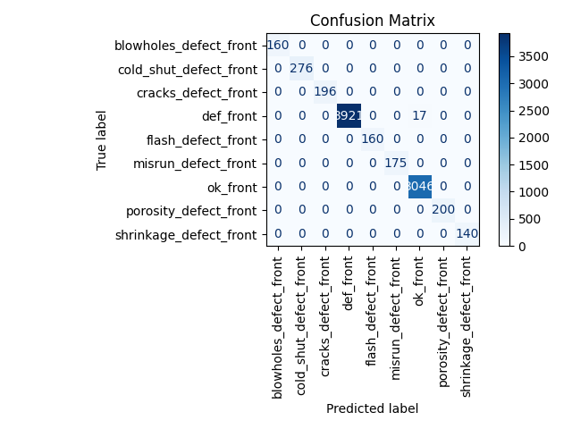
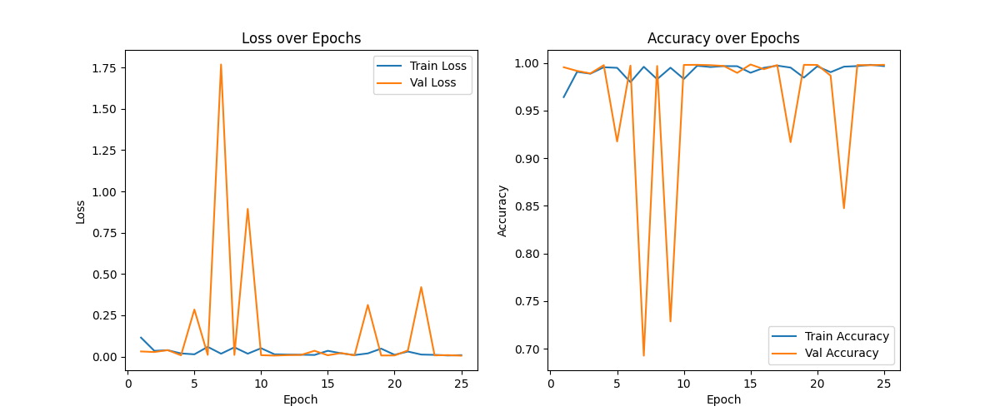

# 🧠 Casting Defect Detection using CNN + Taguchi Optimization

An advanced framework combining **offline process optimization** using **Taguchi's Orthogonal Array** and **online surface defect detection** using a **ResNet-based Convolutional Neural Network (CNN)**. This project ensures high-quality **LM6 aluminum castings** for critical industries like **automotive** and **aerospace**.

---

## 📌 Table of Contents

- [🔍 Project Overview](#-project-overview)
- [🎯 Key Objectives](#-key-objectives)
- [⚙️ Methodology](#️-methodology)
- [📊 Dataset](#-dataset)
- [🧠 CNN Model Architecture](#-cnn-model-architecture)
- [📈 Training Performance](#-training-performance)
- [📋 Classification Report](#-classification-report)
- [🌐 Web App Deployment](#-web-app-deployment)
- [🖼️ Visualizations](#-visualizations)
- [💻 How to Run Locally](#-how-to-run-locally)
- [📚 Technologies Used](#-technologies-used)
- [📝 License](#-license)

---

## 🔍 Project Overview

Aluminum LM6 is known for its **corrosion resistance**, **strength-to-weight ratio**, and **thermal stability**. However, casting defects like **porosity**, **cold shuts**, and **blowholes** degrade product quality.

### ✅ Our dual-solution approach:
1. **Taguchi L9 Orthogonal Array** for offline process optimization.
2. **CNN Model** for automated surface defect detection in real-time using image classification.

---

## 🎯 Key Objectives

- **Optimize** LM6 casting parameters (Heating Temperature, Time, Scum Powder, Magnesium Powder).
- **Classify** 9 types of casting defects using deep learning.
- **Deploy** a web-based app for real-time casting defect detection.

---

## ⚙️ Methodology

```text
1. Design of Experiments using Taguchi L9 Array
2. Surface defect imaging of castings
3. Dataset labeling and augmentation
4. CNN training (ResNet-based)
5. Performance evaluation with metrics
6. Streamlit-based deployment
```

---

## 📊 Dataset

- **Total Images**: 3,600+
- **Image Size**: 224×224 RGB
- **Classes (9)**:
  - `ok_front`
  - `def_front`
  - `blowholes_defect_front`
  - `cold_shut_defect_front`
  - `cracks_defect_front`
  - `flash_defect_front`
  - `misrun_defect_front`
  - `porosity_defect_front`
  - `shrinkage_defect_front`

- **Split**: 70% Train / 30% Test
- **Preprocessing**: Normalization, grayscale, augmentation

---

## 🧠 CNN Model Architecture

A modified **ResNet** CNN model was implemented using **PyTorch**, structured as follows:

- **Input**: 224x224x3 images
- **Conv Layers**:  
  - Conv1: 64 filters (7×7)  
  - Conv2: 128 filters (3×3)  
  - Conv3: 256 filters (3×3)  
  - Conv4: 512 filters (3×3)
- **Fully Connected**: 512 Neurons
- **Output Layer**: 9 Neurons (Softmax)

> Total Trainable Parameters: ~12M  
> Device: NVIDIA GeForce GTX 1650  
> GPU Memory Used: 0.185 GB

---

## 📈 Training Performance

| Metric         | Training         | Validation        |
|----------------|------------------|-------------------|
| Accuracy       | 99.66%           | 99.79%            |
| Loss           | 0.0088           | 0.0056            |
| Epochs         | 25               |                   |
| Optimizer      | Adam             |                   |
| Loss Function  | Binary Cross Entropy |              |

---

## 📋 Classification Report

```text
Precision, Recall, F1-score (Validation Accuracy = 99.79%)

ok_front                  0.99     1.00     1.00     3046
def_front                1.00     1.00     1.00     3938
porosity_defect_front    1.00     1.00     1.00      200
cold_shut_defect_front   1.00     1.00     1.00      276
cracks_defect_front      1.00     1.00     1.00      196
blowholes_defect_front   1.00     1.00     1.00      160
flash_defect_front       1.00     1.00     1.00      160
misrun_defect_front      1.00     1.00     1.00      175
shrinkage_defect_front   1.00     1.00     1.00      140
```

---

## 🌐 Web App Deployment

The model is deployed using **Streamlit** for real-time image classification.

### Features:
- Upload multiple images
- Real-time defect classification
- Confidence score output

```bash
# Run locally
streamlit run app.py
```

---

## 🖼️ Visualizations

### 🔹 Confusion Matrix


### 🔹 Training Curves


---

## 💻 How to Run Locally

```bash
git clone https://github.com/yourusername/casting-defect-detection-cnn.git
cd casting-defect-detection-cnn
pip install -r requirements.txt
streamlit run app.py
```

---

## 📚 Technologies Used

- Python, NumPy, Pandas
- PyTorch, Torchvision
- OpenCV
- Matplotlib, Seaborn
- Streamlit
- Taguchi Method (L9 OA)

---

## 📝 License

This project is licensed under the MIT License.

---

> Built with 💡 for smarter casting inspection & manufacturing excellence.